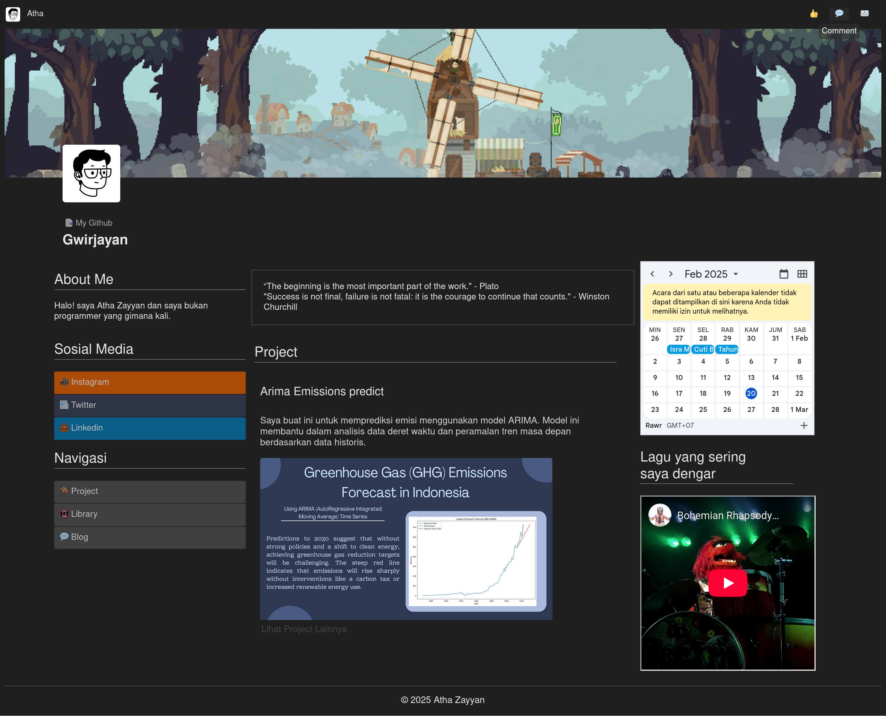

# PortofolioNotionSlicing

Tampilan Website dapat dilihat di sini 
[Sini](https://athazayyan.github.io/Portfolio/index.html)
 
## Deskripsi Proyek

Proyek ini adalah slicing dari desain Notion ke dalam HTML dan CSS. Tujuannya adalah untuk Website Portofolio saya.

## Fitur

- Desain Portofolio responsif yang mirip dengan Notion
- Navigasi yang mudah digunakan

## Teknologi yang Digunakan

- HTML
- CSS

##Tampilan



## Cara Mennyunting Proyek Sesuai Yang Anda Kehendaki dan Buka di Lokal Anda

1. Clone repositori ini:
    ```bash
    git clone https://github.com/username/PortofolioNotionSlicing.git
    ```
2. Buka file `index.html` di browser Anda.


 

@Atha
Untuk Tugas PBW PRAKTIKUM
